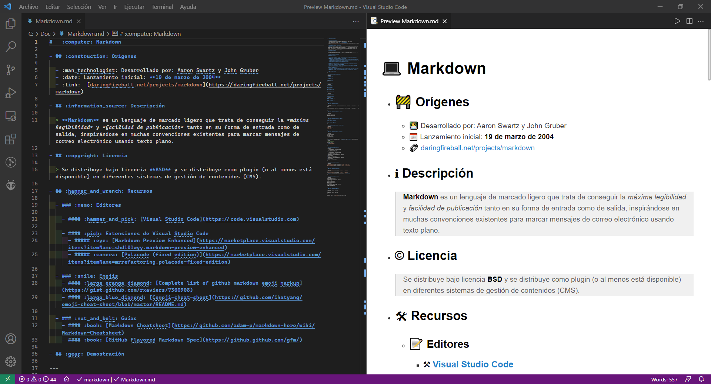

# 	:computer: Markdown



- ## :construction: Orígenes

  - :man_technologist: Desarrollado por: Aaron Swartz y John Gruber
  - :date: Lanzamiento inicial: **19 de marzo de 2004**
  - :link:  [daringfireball.net/projects/markdown](https://daringfireball.net/projects/markdown)

- ## :information_source: Descripción

  > **Markdown** es un lenguaje de marcado ligero que trata de conseguir la *máxima legibilidad* y *facilidad de publicación* tanto en su forma de entrada como de salida, inspirándose en muchas convenciones existentes para marcar mensajes de correo electrónico usando texto plano. 

- ## :copyright: Licencia

  > Se distribuye bajo licencia **BSD** y se distribuye como plugin (o al menos está disponible) en diferentes sistemas de gestión de contenidos (CMS).

- ## :hammer_and_wrench: Recursos

  - ### :memo: Editores

    - #### :hammer_and_pick: [Visual Studio Code](https://code.visualstudio.com)
  
    - #### :pick: Extensiones de Visual Studio Code
      - ##### :eye: [Markdown Preview Enhanced](https://marketplace.visualstudio.com/items?itemName=shd101wyy.markdown-preview-enhanced)
      - ##### :camera: [Polacode (fixed edition)](https://marketplace.visualstudio.com/items?itemName=mrrefactoring.polacode-fixed-edition)
  
  - ### :smile: Emojis 
    - #### :large_orange_diamond: [Complete list of github markdown emoji markup](https://gist.github.com/rxaviers/7360908)
    - #### :large_blue_diamond: [Cemoji-cheat-sheet](https://github.com/ikatyang/emoji-cheat-sheet/blob/master/README.md)

  - ### :nut_and_bolt: Guías
    - #### :book: [Markdown Cheatsheet](https://github.com/adam-p/markdown-here/wiki/Markdown-Cheatsheet)
    - #### :book: [GitHub Flavored Markdown Spec](https://github.github.com/gfm/)
    - #### :book: [Qué es Markdown](https://markdown.es)

- ## :gear: Demostración

---

- ### :heavy_check_mark: Encabezados:

```markdown
# Encabezado h1
```
# Encabezado h1
```markdown
## Encabezado h2
```
## Encabezado h2
```markdown
### Encabezado h3
```
### Encabezado h3
```markdown
#### Encabezado h4
```
#### Encabezado h4
```markdown
##### Encabezado h5
```
##### Encabezado h5
```markdown
###### Encabezado h6
```
###### Encabezado h6

---

- ### :heavy_check_mark: Citas:

```markdown
> El éxito no es el final, el fracaso no es la ruina, el coraje de continuar es lo que cuenta.
```
> El éxito no es el final, el fracaso no es la ruina, el coraje de continuar es lo que cuenta.

---

- ### :heavy_check_mark: Texto en Cursiva:

```markdown
*Esto está en cursiva*
```
*Esto está en cursiva*

---

- ### :heavy_check_mark: Texto en Negrita:

```markdown
**Esto está en negrita**
```
**Esto está en negrita**

---

- ### :heavy_check_mark: Código en una línea:

```markdown
`code, die = 1, 0`
```
`code, die = 1, 0`

---

- ### :heavy_check_mark: Código en bloque:

```markdown
` ` `python
#!/usr/bin/python3
code, die = 1, 0
if (code or die):
  print('well done')
` ` `  
```
> **NOTA:** En el código anterior en la **primera** y **última** línea no debe haber separación de espacios, sino ser así :point_right: **```**  
```python
#!/usr/bin/python3
code, die = 1, 0
if (code or die):
  print('well done')
```

---

- ### :heavy_check_mark: Listas desordenadas:

```markdown
- Un elemento en una lista no ordenada
* Otro elemento en una lista
* Del mismo tipo anterior
+ Tercer y último elemento
```
- Un elemento en una lista no ordenada
* Otro elemento en una lista
* Del mismo tipo anterior
+ Tercer y último elemento
---

- ### :heavy_check_mark: Listas ordenadas:

```markdown
1. Elemento en una lista enumerada u ordenada.
2. Otro elemento
3. Tercer y último elemento
```
1. Elemento en una lista enumerada u ordenada.
2. Otro elemento
3. Tercer y último elemento

---

- ### :heavy_check_mark: Enlaces:

```markdown
[Página de Nelbren](https://nelbren.com "Titulo de la página")
```
[Página de Nelbren](https://nelbren.com "Titulo de la página")

---

- ### :heavy_check_mark: Imágenes:

```markdown

```

> **NOTA:** imagen generada usando la extensión de **polacode**.

---

- ### :heavy_check_mark: Tablas:

```markdown
|#|Descripción|Detalle|
|--:|:--:|:--|
|1|Primera descripción|Algún detalle| 
|...|...|...|
|1,000|Última|Detalle|
```
|#|Descripción|Detalle|
|--:|:--:|:--|
|1|Primera descripción|Algún detalle| 
|...|...|...|
|1,000|Última|Detalle|

---

- ### :heavy_check_mark: Emojis:

```markdown
:sunglasses: :smile: :worried:
````
:sunglasses: :smile: :worried:

---
<div style="text-align: right">Hecho con ❤️ por <strong>Nelbren</strong></div>